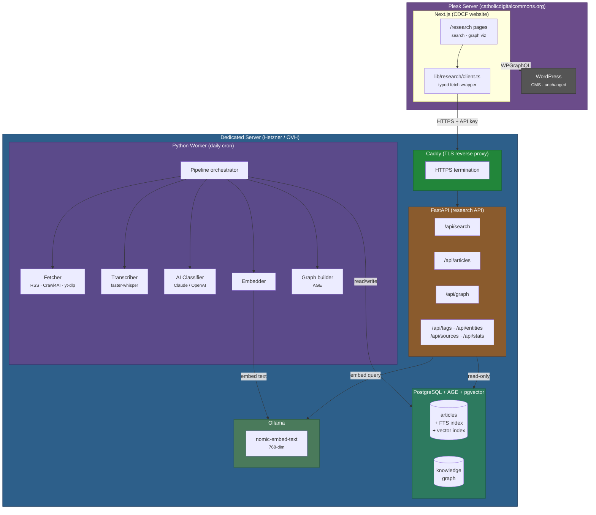

# Catholic Tech Content Aggregator — Implementation Plan

## Overview

An AI-powered system that daily scours Catholic media (RSS feeds, news sites, Vatican documents), multimedia (YouTube channels, podcasts), and academic sources (arXiv papers, Catholic university news) for content related to technology and the Church. Results are stored in PostgreSQL with full-text search, linked in a knowledge graph, and made searchable/browsable on the CDCF website.

## Architecture



**Key design decisions:**

- **Two-server topology** — the aggregator runs on a dedicated server (Hetzner/OVH) separate from the Plesk server hosting the CDCF website. A FastAPI service on the dedicated server exposes a REST API that the Next.js frontend calls over HTTPS, authenticated with an API key. This keeps the database private, avoids exposing PostgreSQL ports, and allows the aggregation pipeline to use CPU/RAM without impacting the website.
- **PostgreSQL with Apache AGE + pgvector** — single database for relational data, full-text search (tsvector), vector similarity search (pgvector), and property-graph queries (openCypher). No separate graph database or vector store needed.
- **FastAPI research API** — a lightweight Python API server on the dedicated server that handles search queries (including embedding the query text via Ollama), article retrieval, graph data, and faceted browsing. Protected by API key authentication.
- **Python worker** — runs daily via cron (or a loop with sleep). Modular design with swappable AI providers. Docker resource limits (`--cpus`, `--memory`) prevent the worker from starving the API during aggregation.
- **Next.js `/research` route** — a standalone section of the existing site. Server components fetch from the aggregator API using a typed client (`lib/research/client.ts`), following the same pattern as the existing WPGraphQL integration.
- **[Crawl4AI](https://github.com/unclecode/crawl4ai)** — open-source web crawler purpose-built for LLM pipelines. Outputs clean Markdown from any web page (including JavaScript-rendered content via Playwright), eliminating the need for manual HTML-to-text extraction. RSS feeds are still parsed directly with `feedparser`.
- **Multimedia ingestion** — YouTube channels and podcasts are first-class source types. Audio/video content is transcribed and summarized by dedicated tools before entering the standard AI classification pipeline (see [Multimedia Processing](#multimedia-processing) below).
- **Academic sources** — arXiv papers, Catholic university news, and academic institution feeds are monitored for research at the intersection of technology, ethics, and the Church. Papers are fetched via the arXiv API and PDF text extraction; university news via RSS/web crawling (see [Academic & Scientific Sources](#academic--scientific-sources) below).
- **Decoupled from WordPress** — the aggregator is an independent subsystem. WordPress continues to serve CMS content; the research section queries the aggregator API.

## Database Schema

### PostgreSQL Tables

```sql
-- Vector similarity search
CREATE EXTENSION IF NOT EXISTS vector;

-- Sources (RSS feeds, websites to monitor)
CREATE TABLE sources (
    id              SERIAL PRIMARY KEY,
    name            TEXT NOT NULL,
    url             TEXT NOT NULL UNIQUE,
    source_type     TEXT NOT NULL CHECK (source_type IN ('rss', 'web', 'vatican', 'api', 'youtube', 'podcast', 'arxiv')),
    origin          TEXT NOT NULL DEFAULT 'manual' CHECK (origin IN ('manual', 'discovered')),
    fetch_interval  INTERVAL NOT NULL DEFAULT '1 day',
    last_fetched_at TIMESTAMPTZ,
    is_active       BOOLEAN NOT NULL DEFAULT true,
    config          JSONB DEFAULT '{}',  -- source-specific settings (selectors, auth, etc.)
    created_at      TIMESTAMPTZ NOT NULL DEFAULT now()
);

-- Candidate sources discovered by the aggregator, pending promotion
CREATE TABLE candidate_sources (
    id              SERIAL PRIMARY KEY,
    name            TEXT NOT NULL,
    url             TEXT NOT NULL UNIQUE,
    source_type     TEXT NOT NULL CHECK (source_type IN ('rss', 'web', 'youtube', 'podcast', 'arxiv')),
    discovered_from INT REFERENCES articles(id),  -- article where this source was found
    confidence      REAL NOT NULL DEFAULT 0.0,     -- AI confidence score 0.0–1.0
    hit_count       INT NOT NULL DEFAULT 1,        -- how many times links from this domain appeared
    avg_relevance   REAL NOT NULL DEFAULT 0.0,     -- average relevance of articles from this domain
    status          TEXT NOT NULL DEFAULT 'pending' CHECK (status IN ('pending', 'auto_promoted', 'approved', 'rejected')),
    promoted_to     INT REFERENCES sources(id),    -- set when promoted to active source
    reviewed_at     TIMESTAMPTZ,
    created_at      TIMESTAMPTZ NOT NULL DEFAULT now(),
    updated_at      TIMESTAMPTZ NOT NULL DEFAULT now()
);

CREATE INDEX idx_candidate_sources_status ON candidate_sources (status) WHERE status = 'pending';

-- Articles / documents discovered
CREATE TABLE articles (
    id              SERIAL PRIMARY KEY,
    source_id       INT NOT NULL REFERENCES sources(id),
    external_url    TEXT NOT NULL UNIQUE,
    title           TEXT NOT NULL,
    author          TEXT,
    published_at    TIMESTAMPTZ,
    fetched_at      TIMESTAMPTZ NOT NULL DEFAULT now(),
    content_type    TEXT NOT NULL DEFAULT 'article' CHECK (content_type IN ('article', 'video', 'podcast_episode', 'audio', 'paper')),
    content_text    TEXT,               -- plain text or transcript (for FTS)
    content_html    TEXT,               -- original HTML (null for AV content)
    transcript      TEXT,               -- full transcript for audio/video content
    summary         TEXT,               -- AI-generated summary
    language        TEXT DEFAULT 'en',
    duration_seconds INT,               -- duration for audio/video content
    media_url       TEXT,               -- direct URL to audio/video file or stream
    thumbnail_url   TEXT,               -- thumbnail/poster image URL
    relevance_score REAL DEFAULT 0.0,   -- AI-assigned 0.0–1.0
    embedding       vector(768),       -- semantic embedding (populated async by embedder)
    metadata        JSONB DEFAULT '{}', -- arbitrary extra fields

    -- Full-text search vector (auto-updated via trigger)
    -- For AV content, transcript is indexed at weight C alongside content_text
    search_vector   TSVECTOR GENERATED ALWAYS AS (
        setweight(to_tsvector('english', coalesce(title, '')), 'A') ||
        setweight(to_tsvector('english', coalesce(summary, '')), 'B') ||
        setweight(to_tsvector('english', coalesce(content_text, '')), 'C') ||
        setweight(to_tsvector('english', coalesce(transcript, '')), 'C')
    ) STORED
);

CREATE INDEX idx_articles_search ON articles USING GIN (search_vector);
CREATE INDEX idx_articles_embedding ON articles USING hnsw (embedding vector_cosine_ops);
CREATE INDEX idx_articles_published ON articles (published_at DESC);
CREATE INDEX idx_articles_relevance ON articles (relevance_score DESC);
CREATE INDEX idx_articles_source ON articles (source_id);

-- Tags / categories (AI-assigned)
CREATE TABLE tags (
    id   SERIAL PRIMARY KEY,
    name TEXT NOT NULL UNIQUE,
    slug TEXT NOT NULL UNIQUE
);

CREATE TABLE article_tags (
    article_id INT NOT NULL REFERENCES articles(id) ON DELETE CASCADE,
    tag_id     INT NOT NULL REFERENCES tags(id) ON DELETE CASCADE,
    confidence REAL DEFAULT 1.0,  -- AI confidence in this tag
    PRIMARY KEY (article_id, tag_id)
);

-- Named entities extracted by AI
CREATE TABLE entities (
    id          SERIAL PRIMARY KEY,
    name        TEXT NOT NULL,
    entity_type TEXT NOT NULL CHECK (entity_type IN (
        'person', 'organization', 'project', 'document', 'event', 'location', 'concept', 'university', 'journal'
    )),
    description TEXT,
    external_url TEXT,
    embedding   vector(768),   -- for entity disambiguation (merge "Bishop Barron" / "Robert Barron" / "Bp. Barron")
    UNIQUE (name, entity_type)
);

CREATE INDEX idx_entities_embedding ON entities USING hnsw (embedding vector_cosine_ops);

-- Article–entity associations
CREATE TABLE article_entities (
    article_id INT NOT NULL REFERENCES articles(id) ON DELETE CASCADE,
    entity_id  INT NOT NULL REFERENCES entities(id) ON DELETE CASCADE,
    role       TEXT,  -- e.g. 'author', 'subject', 'publisher', 'mentioned'
    PRIMARY KEY (article_id, entity_id, COALESCE(role, ''))
);

-- Links discovered within article content (for link-following crawler)
CREATE TABLE discovered_links (
    id              SERIAL PRIMARY KEY,
    source_article_id INT NOT NULL REFERENCES articles(id) ON DELETE CASCADE,
    target_url      TEXT NOT NULL,
    target_article_id INT REFERENCES articles(id),  -- set once the target is fetched
    link_type       TEXT,           -- AI-classified: 'cited_document', 'related_project', 'source_reference', 'press_release'
    link_context    TEXT,           -- surrounding text where the link appeared
    domain          TEXT NOT NULL,  -- extracted domain for allowlist filtering
    crawl_depth     INT NOT NULL DEFAULT 1,
    status          TEXT NOT NULL DEFAULT 'pending' CHECK (status IN ('pending', 'fetched', 'skipped', 'error')),
    discovered_at   TIMESTAMPTZ NOT NULL DEFAULT now(),
    UNIQUE (source_article_id, target_url)
);

CREATE INDEX idx_discovered_links_status ON discovered_links (status) WHERE status = 'pending';
CREATE INDEX idx_discovered_links_target ON discovered_links (target_url);

-- Processing log (audit trail)
CREATE TABLE processing_log (
    id           SERIAL PRIMARY KEY,
    article_id   INT REFERENCES articles(id),
    step         TEXT NOT NULL,  -- 'fetch', 'classify', 'tag', 'graph'
    status       TEXT NOT NULL CHECK (status IN ('success', 'error', 'skipped')),
    details      JSONB DEFAULT '{}',
    processed_at TIMESTAMPTZ NOT NULL DEFAULT now()
);
```

### Apache AGE Knowledge Graph

The knowledge graph is built on top of the relational data using Apache AGE (a PostgreSQL extension that adds openCypher graph queries).

```sql
-- Enable the extension
CREATE EXTENSION IF NOT EXISTS age;
LOAD 'age';
SET search_path = ag_catalog, "$user", public;

SELECT create_graph('catholic_tech');
```

**Node types (labels):**

| Label | Properties | Mapped from |
|-------|-----------|-------------|
| `Article` | `id`, `title`, `url`, `published_at`, `relevance_score` | `articles` table |
| `Entity` | `id`, `name`, `entity_type`, `description` | `entities` table |
| `Tag` | `id`, `name`, `slug` | `tags` table |
| `Source` | `id`, `name`, `url`, `source_type` | `sources` table |

**Edge types:**

| Edge | From → To | Properties |
|------|-----------|------------|
| `TAGGED_WITH` | Article → Tag | `confidence` |
| `MENTIONS` | Article → Entity | `role` |
| `PUBLISHED_BY` | Article → Source | — |
| `RELATED_TO` | Entity → Entity | `relation_type`, `weight` |
| `CO_OCCURS_WITH` | Entity → Entity | `count`, `articles[]` |
| `REFERENCES` | Article → Article | `link_type`, `context` |

Entity-to-entity relationships (`RELATED_TO`, `CO_OCCURS_WITH`) are inferred by the AI classifier and co-occurrence analysis. `REFERENCES` edges are created when an article links to another document that was also ingested — `link_type` indicates the nature of the reference (e.g. `cited_document`, `related_project`, `source_reference`, `press_release`) and `context` stores the surrounding text where the link appeared.

## Python Worker

### Directory Structure

```
aggregator/
├── __init__.py
├── __main__.py           # Entry point: `python -m aggregator`
├── config.py             # Settings from env vars
├── pipeline.py           # Orchestrates the full daily run
├── fetchers/
│   ├── __init__.py
│   ├── base.py           # Abstract fetcher interface
│   ├── rss.py            # RSS/Atom feed fetcher (feedparser)
│   ├── crawl4ai.py       # Web fetcher using Crawl4AI (Markdown output)
│   ├── vatican.py        # Vatican.va specific fetcher (extends crawl4ai)
│   ├── youtube.py        # YouTube channel/playlist fetcher (yt-dlp + transcription)
│   ├── podcast.py        # Podcast RSS feed fetcher (feedparser + audio download)
│   └── arxiv.py          # arXiv / academic paper fetcher (arXiv API + PDF extraction)
├── ai/
│   ├── __init__.py
│   ├── base.py           # Abstract AI provider interface
│   ├── claude.py         # Anthropic Claude provider
│   └── openai.py         # OpenAI provider
├── processors/
│   ├── __init__.py
│   ├── classifier.py     # Relevance scoring + tag assignment
│   ├── extractor.py      # Named entity extraction
│   ├── summarizer.py     # Article summarization
│   ├── transcriber.py    # Audio/video transcription (Whisper)
│   ├── embedder.py       # Vector embedding generation (Ollama / OpenAI)
│   ├── link_follower.py  # Discover + crawl outbound links from articles
│   └── source_discoverer.py  # Auto-discover and promote new sources
├── graph/
│   ├── __init__.py
│   └── builder.py        # Apache AGE graph builder
├── db.py                 # Database connection + helpers (psycopg)
└── models.py             # Pydantic models for articles, entities, etc.
```

### Pipeline Flow

```
1. Load active sources from `sources` table
2. For each source due for refresh:
   a. Fetch new items (RSS → feedparser, web → Crawl4AI)
   b. Deduplicate against existing articles (by external_url)
   c. For each new article:
      i.    For web sources: Crawl4AI returns clean Markdown directly; for RSS: extract text from HTML
      ii.   Generate embedding for article text (title + content excerpt → vector)
      iii.  Corpus centroid pre-filter: skip if cosine distance from centroid > AGG_CENTROID_MAX_DISTANCE
      iv.   AI: Score relevance (0.0–1.0) — skip if < 0.3
      v.    AI: Generate summary (1–2 sentences)
      vi.   AI: Assign tags from controlled vocabulary + suggest new ones
      vii.  AI: Extract named entities (people, orgs, projects, documents)
      viii. Insert article + tags + entities into PostgreSQL
      ix.   Re-embed article with enriched text (title + summary + tags → vector)
      x.    Sync to Apache AGE graph (nodes + edges)
      xi.   Log processing result
3. Entity disambiguation pass (see Vector Embeddings below)
4. Link-following pass (see below)
5. Source discovery pass (see below)
6. Run co-occurrence analysis across recent articles
7. Update graph edges for entity relationships
```

### Link Following

After the initial fetch-and-classify pass, the pipeline runs a **link-following step** that discovers and crawls outbound links found within article content.

```
4. Link-following pass:
   a. For each newly ingested article:
      i.   Extract all outbound URLs from content_html
      ii.  Filter against domain allowlist (see below) — skip social media, ads, navigation links
      iii. Deduplicate against articles.external_url and discovered_links.target_url
      iv.  AI: Classify each link's type (cited_document, related_project, source_reference, press_release)
           and extract the surrounding context text
      v.   Insert into discovered_links table with status='pending'
   b. For each pending discovered link (up to depth limit):
      i.   Fetch the target URL via Crawl4AI (respecting robots.txt and rate limits)
      ii.  Crawl4AI returns clean Markdown — ready for AI processing
      iii. AI: Score relevance (0.0–1.0) — mark as 'skipped' if < 0.3
      iv.  If relevant: insert as a new article, run full classification pipeline (summary, tags, entities)
      v.   Set discovered_links.target_article_id and status='fetched'
      vi.  Create REFERENCES edge in the knowledge graph
      vii. Recursively discover outbound links from the new article (if crawl_depth < max)
```

**Safeguards:**

| Setting | Default | Description |
|---------|---------|-------------|
| `AGG_LINK_MAX_DEPTH` | `2` | Maximum crawl depth from original source article |
| `AGG_LINK_BATCH_SIZE` | `50` | Max discovered links to process per pipeline run |
| `AGG_LINK_RATE_LIMIT` | `2` | Seconds between requests to the same domain |
| `AGG_LINK_RELEVANCE_THRESHOLD` | `0.4` | Minimum relevance to ingest a discovered link (slightly higher than source threshold) |

**Domain allowlist** — only links to these domain categories are followed:

- Vatican domains (`vatican.va`, `vaticannews.va`)
- Catholic news outlets (domains from the Initial Source List)
- GitHub repositories and project pages (`github.com`, `gitlab.com`)
- University/academic domains (`.edu`, `.ac.*`, `arxiv.org`, `doi.org`, `scholar.google.com`)
- Church organization domains (`usccb.org`, national bishops' conferences)
- Curated additions stored in a `link_domain_allowlist` config table

Links to social media (Twitter/X, Facebook, Instagram), generic platforms (Medium), and unrecognized domains are skipped by default. YouTube links discovered within articles are evaluated: if they point to a channel already in the `sources` table, the specific video is queued for transcription; otherwise they are skipped. The allowlist can be extended at runtime without code changes via the `link_domain_allowlist` table or a `AGG_LINK_EXTRA_DOMAINS` environment variable.

### Source Discovery

As the aggregator follows links and ingests articles, it tracks which external domains consistently produce relevant content. When a domain crosses a confidence threshold, it is automatically promoted to a crawlable source — enabling the system to organically grow its source list over time.

```
5. Source discovery pass:
   a. Aggregate stats from recently ingested articles by domain:
      - Count of articles ingested from this domain
      - Average relevance score across those articles
      - Whether the domain offers an RSS feed (auto-detected via <link rel="alternate"> or /feed, /rss paths)
   b. For each domain not already in sources or candidate_sources:
      i.   AI: Evaluate the domain — is it a Catholic news outlet, blog, or institutional site?
           Score confidence (0.0–1.0) based on domain name, article content patterns, and About page
      ii.  Insert into candidate_sources with confidence score
   c. For existing candidate_sources, update hit_count and avg_relevance with new data
   d. Auto-promote candidates that meet ALL of these criteria:
      - confidence >= AGG_SOURCE_AUTO_PROMOTE_CONFIDENCE (default 0.8)
      - hit_count >= AGG_SOURCE_MIN_HITS (default 5)
      - avg_relevance >= AGG_SOURCE_MIN_AVG_RELEVANCE (default 0.6)
      i.   Insert into sources table (origin='discovered', is_active=true)
      ii.  Set candidate_sources.status='auto_promoted', promoted_to=new source id
      iii. Log the promotion in processing_log
   e. Sources that don't meet auto-promote thresholds remain as 'pending' candidates
      for manual review via the admin interface
```

**Safeguards:**

| Setting | Default | Description |
|---------|---------|-------------|
| `AGG_SOURCE_AUTO_PROMOTE_CONFIDENCE` | `0.8` | Minimum AI confidence to auto-promote a candidate source |
| `AGG_SOURCE_MIN_HITS` | `5` | Minimum articles from this domain before promotion is considered |
| `AGG_SOURCE_MIN_AVG_RELEVANCE` | `0.6` | Minimum average relevance score across articles from this domain |
| `AGG_SOURCE_MAX_AUTO_PER_RUN` | `3` | Maximum sources to auto-promote per pipeline run (prevents runaway growth) |

**Manual review:** Candidates below the auto-promote threshold are visible in the admin interface (and future `/research` admin panel) where a human can approve or reject them. Rejected candidates are not reconsidered unless explicitly reset.

**RSS auto-detection:** When a candidate is promoted, the system attempts to find an RSS/Atom feed on the domain (checking `<link rel="alternate" type="application/rss+xml">`, common paths like `/feed`, `/rss`, `/rss.xml`). If found, the source is created with `source_type='rss'`; otherwise it falls back to `source_type='web'` for HTML scraping.

### Vector Embeddings

Every article and entity gets a dense vector embedding stored in a `pgvector` column with an HNSW index. This enables capabilities that pure keyword search and name-matching cannot provide:

1. **Semantic search** — "machine learning morality" finds articles tagged "AI Ethics" even when keywords don't overlap.
2. **Cross-language discovery** — multilingual embedding models map EN/ES/PT/IT/FR/DE content into the same vector space, so a Spanish article on "ética digital" surfaces alongside English articles on "digital ethics."
3. **Entity disambiguation** — "Bishop Barron," "Robert Barron," and "Bp. Barron" are recognized as the same person by comparing entity embeddings rather than relying on exact name matching.
4. **Corpus centroid pre-filter** — articles semantically far from the corpus centroid are likely off-topic, enabling a cheap pre-screen before the expensive AI classification step.

At the scale of this project (low tens of thousands of articles over its lifetime), pgvector with HNSW handles this comfortably.

#### Embedding Model

The default embedding model is **[nomic-embed-text](https://ollama.com/library/nomic-embed-text)** (768 dimensions, strong multilingual support) served locally via **Ollama**. This provides:

- **Zero marginal cost** — no per-request API charges, suitable for ongoing daily pipeline runs.
- **Privacy** — article content never leaves the server.
- **Low latency** — local inference is faster than a cloud API round-trip, which matters when embedding the user's query at search time.
- **No new infrastructure** — Ollama runs as a single Docker container.

OpenAI embeddings (`text-embedding-3-small`, 768 dimensions via the `dimensions` parameter) are available as a cloud fallback for environments where running a local model isn't practical.

#### Embedding Processor

```python
# aggregator/processors/embedder.py
from abc import ABC, abstractmethod

class EmbeddingProvider(ABC):
    @abstractmethod
    async def embed(self, texts: list[str]) -> list[list[float]]:
        """Return a list of embedding vectors for the given texts."""
        ...

class OllamaEmbedder(EmbeddingProvider):
    """Local embeddings via Ollama (nomic-embed-text, 768 dimensions)."""
    def __init__(self, base_url: str = "http://ollama:11434"):
        self.base_url = base_url

    async def embed(self, texts: list[str]) -> list[list[float]]:
        import httpx
        async with httpx.AsyncClient() as client:
            results = []
            for text in texts:
                resp = await client.post(
                    f"{self.base_url}/api/embeddings",
                    json={"model": "nomic-embed-text", "prompt": text}
                )
                results.append(resp.json()["embedding"])
            return results

class OpenAIEmbedder(EmbeddingProvider):
    """OpenAI embeddings (text-embedding-3-small, 768 dimensions)."""
    async def embed(self, texts: list[str]) -> list[list[float]]:
        import openai
        client = openai.AsyncOpenAI()
        result = await client.embeddings.create(
            input=texts, model="text-embedding-3-small", dimensions=768
        )
        return [item.embedding for item in result.data]

class Embedder:
    """Generates and stores embeddings for articles and entities."""

    def __init__(self, provider: EmbeddingProvider, db):
        self.provider = provider
        self.db = db

    async def embed_article(self, article_id: int, title: str, summary: str, tags: list[str]):
        """Build a composite text from title + summary + tags, embed it, and store."""
        text = f"{title}\n{summary}\n{', '.join(tags)}"
        [embedding] = await self.provider.embed([text])
        await self.db.execute(
            "UPDATE articles SET embedding = $1 WHERE id = $2",
            embedding, article_id
        )

    async def embed_entity(self, entity_id: int, name: str, entity_type: str, description: str | None):
        """Embed entity name + type + description for disambiguation."""
        text = f"{name} ({entity_type})"
        if description:
            text += f": {description}"
        [embedding] = await self.provider.embed([text])
        await self.db.execute(
            "UPDATE entities SET embedding = $1 WHERE id = $2",
            embedding, entity_id
        )
```

The provider is selected via the `AGG_EMBEDDING_PROVIDER` environment variable (`ollama` or `openai`). Both produce 768-dimensional vectors. Embeddings are generated in batches during the pipeline run.

#### Corpus Centroid Pre-filter

Before running the expensive AI classification step, the pipeline can cheaply screen out off-topic articles by comparing their embedding to the corpus centroid — the average embedding of all existing articles:

```python
# In pipeline.py, after fetching and embedding a new article but before AI classification
centroid = await db.fetchval("SELECT AVG(embedding) FROM articles WHERE embedding IS NOT NULL")
if centroid is not None:
    distance = cosine_distance(article_embedding, centroid)
    if distance > AGG_CENTROID_MAX_DISTANCE:
        log.info(f"Skipping '{article.title}' — cosine distance {distance:.3f} from corpus centroid exceeds threshold")
        await db.execute(
            "INSERT INTO processing_log (article_id, step, status, details) VALUES ($1, 'centroid_filter', 'skipped', $2)",
            article.id, {"distance": distance, "threshold": AGG_CENTROID_MAX_DISTANCE}
        )
        continue  # skip AI classification entirely
```

This reduces AI API costs by filtering obviously irrelevant articles (e.g. a general sports article that happened to mention a Catholic school) before they reach the classifier. The centroid is recalculated periodically (not on every article) and cached.

#### Entity Disambiguation

After new entities are extracted, the pipeline runs a disambiguation pass:

```
3. Entity disambiguation pass:
   a. For each newly created entity:
      i.   Generate embedding from name + type + description
      ii.  Query existing entities of the same type for nearest neighbors:
           SELECT id, name, 1 - (embedding <=> $1) AS similarity
           FROM entities
           WHERE entity_type = $2 AND id != $3
           ORDER BY embedding <=> $1
           LIMIT 5
      iii. If top match has similarity >= AGG_ENTITY_MERGE_THRESHOLD (default 0.92):
           - Merge: reassign all article_entities rows to the existing entity
           - Update the existing entity's description if the new one is richer
           - Delete the duplicate entity
           - Log the merge in processing_log
      iv.  If similarity is between 0.80 and 0.92: flag for manual review
```

This catches variations like "Bishop Barron" / "Robert Barron" / "Bp. Barron", "USCCB" / "United States Conference of Catholic Bishops", and "Vatican" / "Holy See" (when contextually equivalent).

#### Semantic Search Integration

The search API supports a hybrid search mode that combines FTS and vector similarity using **Reciprocal Rank Fusion (RRF)**. RRF is rank-based rather than score-based, which avoids the problem of comparing FTS scores and cosine similarities that live on fundamentally different scales:

```sql
-- Hybrid search: Reciprocal Rank Fusion (RRF) of FTS + semantic results
WITH fts AS (
    SELECT id,
        ROW_NUMBER() OVER (ORDER BY ts_rank(search_vector, websearch_to_tsquery('english', $1)) DESC) AS rank
    FROM articles
    WHERE search_vector @@ websearch_to_tsquery('english', $1)
),
semantic AS (
    SELECT id,
        ROW_NUMBER() OVER (ORDER BY embedding <=> $2::vector) AS rank
    FROM articles
    WHERE embedding IS NOT NULL
    ORDER BY embedding <=> $2::vector
    LIMIT 100
)
SELECT a.id, a.title, a.summary, a.published_at,
    COALESCE(1.0 / (60 + fts.rank), 0) + COALESCE(1.0 / (60 + sem.rank), 0) AS rrf_score
FROM articles a
LEFT JOIN fts ON a.id = fts.id
LEFT JOIN semantic sem ON a.id = sem.id
WHERE fts.id IS NOT NULL OR sem.id IS NOT NULL
ORDER BY rrf_score DESC
LIMIT $3 OFFSET $4;
```

The constant `60` in the RRF formula is the standard smoothing factor (from the original RRF paper). It prevents top-ranked results from dominating and gives a balanced fusion without requiring any weight tuning.

The search API route embeds the user's query text at request time (a single local Ollama call, ~50ms), then runs the hybrid query.

#### Related Articles

Vector similarity provides a natural "related articles" feature without relying on tag overlap or graph proximity:

```sql
SELECT id, title, summary, published_at,
    1 - (embedding <=> (SELECT embedding FROM articles WHERE id = $1)) AS similarity
FROM articles
WHERE id != $1 AND embedding IS NOT NULL
ORDER BY embedding <=> (SELECT embedding FROM articles WHERE id = $1)
LIMIT 5;
```

This query is used in the article detail view sidebar.

#### Safeguards

| Setting | Default | Description |
|---------|---------|-------------|
| `AGG_EMBEDDING_PROVIDER` | `ollama` | Embedding backend: `ollama` (local nomic-embed-text) or `openai` |
| `AGG_EMBEDDING_MODEL` | `nomic-embed-text` | Ollama model name (ignored when provider is `openai`) |
| `AGG_EMBEDDING_DIMENSIONS` | `768` | Vector dimensions (must match model output) |
| `AGG_EMBEDDING_BATCH_SIZE` | `32` | Articles to embed per batch |
| `AGG_CENTROID_MAX_DISTANCE` | `0.65` | Maximum cosine distance from corpus centroid before skipping AI classification |
| `AGG_ENTITY_MERGE_THRESHOLD` | `0.92` | Minimum cosine similarity to auto-merge duplicate entities |
| `AGG_ENTITY_REVIEW_THRESHOLD` | `0.80` | Minimum similarity to flag entity pair for manual review |

### AI Provider Abstraction

```python
# aggregator/ai/base.py
from abc import ABC, abstractmethod
from pydantic import BaseModel

class ClassificationResult(BaseModel):
    relevance_score: float          # 0.0–1.0
    tags: list[str]
    entities: list[dict]            # {name, type, role}
    summary: str

class AIProvider(ABC):
    @abstractmethod
    async def classify_article(self, title: str, content: str) -> ClassificationResult:
        """Score relevance, extract tags/entities, summarize."""
        ...
```

Both Claude and OpenAI providers implement this interface. The pipeline selects the provider based on the `AI_PROVIDER` environment variable.

### Web Fetching with Crawl4AI

[Crawl4AI](https://github.com/unclecode/crawl4ai) is the web fetching layer for all non-RSS sources. It replaces the typical `httpx + BeautifulSoup` approach with a purpose-built crawler that outputs clean, LLM-ready Markdown.

**Why Crawl4AI over raw HTTP + HTML parsing:**

- **Markdown output** — pages are converted to clean Markdown automatically, removing boilerplate (nav, footer, ads, sidebars). This feeds directly into the AI classifier without a separate text-extraction step.
- **JavaScript rendering** — built on Playwright, so it handles SPAs, lazy-loaded content, and infinite scroll (common on modern news sites).
- **Structured extraction** — supports CSS/XPath selectors and LLM-powered extraction with custom schemas, useful for consistently structured pages like Vatican document indexes.
- **Session management** — persistent browser sessions for sites that require cookies or authentication.
- **Self-hosted** — runs entirely within the Docker stack, no external API dependencies or per-request costs.

**Integration in the pipeline:**

```python
# aggregator/fetchers/crawl4ai.py
from crawl4ai import AsyncWebCrawler, CrawlerRunConfig, BrowserConfig

class Crawl4AIFetcher(BaseFetcher):
    async def fetch(self, url: str) -> FetchResult:
        browser_config = BrowserConfig(headless=True)
        run_config = CrawlerRunConfig(
            word_count_threshold=50,       # skip pages with very little content
            excluded_tags=["nav", "footer", "aside", "header"],
            bypass_cache=False,
        )
        async with AsyncWebCrawler(config=browser_config) as crawler:
            result = await crawler.arun(url=url, config=run_config)
            return FetchResult(
                markdown=result.markdown,          # clean Markdown for AI
                raw_html=result.html,              # preserved for reference
                links=result.links,                # extracted outbound links (for link-following)
                metadata=result.metadata,          # title, description, author, etc.
            )
```

Crawl4AI also extracts all outbound links from the page, which feeds directly into the link-following step — no separate link-extraction pass needed.

**RSS feeds** are still handled by `feedparser` directly, since RSS provides structured data (title, content, date, author) without needing a browser. When an RSS entry links to a full article, Crawl4AI fetches the full page content if the RSS excerpt is truncated.

### Multimedia Processing

YouTube channels, podcasts, and other audio/video sources are first-class content types. Since the AI classification pipeline operates on text, multimedia content must be **transcribed** before it can be scored, tagged, and summarized.

#### Transcription Stack

| Tool | Purpose | Notes |
|------|---------|-------|
| **[OpenAI Whisper](https://github.com/openai/whisper)** (local) | Speech-to-text transcription | Runs locally via `faster-whisper` (CTranslate2-optimized). No API costs. Model size configurable (`base`, `small`, `medium`, `large-v3`). |
| **OpenAI Whisper API** (cloud fallback) | Speech-to-text transcription | Used when local transcription is disabled or for languages where local models underperform. Per-minute cost. |
| **[yt-dlp](https://github.com/yt-dlp/yt-dlp)** | YouTube audio extraction | Downloads audio-only streams (no video) to minimize bandwidth/storage. Also extracts metadata (title, description, duration, thumbnail, upload date, channel info). |
| **[feedparser](https://github.com/kurtmckee/feedparser)** | Podcast RSS parsing | Parses podcast RSS/Atom feeds to discover episodes. Extracts enclosure URLs (audio files), episode metadata, and show notes. |

The transcription provider is selected via the `AGG_TRANSCRIPTION_PROVIDER` environment variable (`local` or `openai_api`). Local transcription is the default to avoid per-minute API costs.

#### YouTube Fetcher

```python
# aggregator/fetchers/youtube.py
class YouTubeFetcher(BaseFetcher):
    """Fetches new videos from YouTube channels/playlists."""

    async def fetch(self, source_url: str) -> list[FetchResult]:
        # 1. Use yt-dlp to list recent videos from channel/playlist
        #    (--flat-playlist --dateafter <last_fetched>)
        # 2. For each new video:
        #    a. Download audio-only stream (yt-dlp -x --audio-format mp3)
        #    b. Extract metadata (title, description, duration, thumbnail, upload date)
        #    c. Check for existing YouTube captions (yt-dlp --write-auto-sub)
        #       - If captions exist, use them directly (faster, free)
        #       - If no captions, transcribe audio via Whisper
        #    d. Clean up downloaded audio file after transcription
        # 3. Return FetchResult with transcript as content_text,
        #    video description as content_html, media metadata populated
```

**YouTube caption priority:** Many YouTube videos already have auto-generated or manually uploaded captions. The fetcher checks for these first (via `yt-dlp --write-auto-sub --sub-lang en`) and uses them when available, falling back to Whisper transcription only when captions are missing or of poor quality.

#### Podcast Fetcher

```python
# aggregator/fetchers/podcast.py
class PodcastFetcher(BaseFetcher):
    """Fetches new episodes from podcast RSS feeds."""

    async def fetch(self, source_url: str) -> list[FetchResult]:
        # 1. Parse podcast RSS feed with feedparser
        # 2. For each new episode (since last_fetched):
        #    a. Download audio file from enclosure URL
        #    b. Extract episode metadata (title, description, duration, publish date)
        #    c. Transcribe audio via Whisper
        #    d. Use show notes / episode description as supplementary content
        #    e. Clean up downloaded audio file after transcription
        # 3. Return FetchResult with transcript as content_text,
        #    show notes as content_html, media metadata populated
```

#### Transcription Processor

```python
# aggregator/processors/transcriber.py
class Transcriber:
    """Transcribes audio/video content to text."""

    async def transcribe(self, audio_path: str, language: str = None) -> TranscriptionResult:
        if self.provider == 'local':
            # Use faster-whisper (CTranslate2-optimized Whisper)
            from faster_whisper import WhisperModel
            model = WhisperModel(self.model_size, device="cpu", compute_type="int8")
            segments, info = model.transcribe(audio_path, language=language)
            text = " ".join(seg.text for seg in segments)
        elif self.provider == 'openai_api':
            # Use OpenAI Whisper API
            with open(audio_path, "rb") as f:
                response = openai.audio.transcriptions.create(
                    model="whisper-1", file=f, language=language
                )
            text = response.text

        return TranscriptionResult(
            text=text,
            language=info.language if self.provider == 'local' else language,
            duration_seconds=info.duration if self.provider == 'local' else None,
        )
```

#### Pipeline Integration

For multimedia sources, the pipeline flow is extended:

```
2. For each source due for refresh:
   a. Fetch new items:
      - RSS → feedparser
      - Web → Crawl4AI
      - YouTube → yt-dlp (audio extraction + metadata)
      - Podcast → feedparser (RSS) + audio download
   b. For YouTube/podcast items:
      i.   Check for existing captions/transcripts (YouTube only)
      ii.  If no captions: transcribe audio via Whisper (local or API)
      iii. Set content_text = transcript, content_type = 'video' or 'podcast_episode'
      iv.  Store duration_seconds, media_url, thumbnail_url
   c. Deduplicate against existing articles (by external_url)
   d. For each new article/episode/video:
      ... (standard AI classification pipeline continues unchanged)
```

The AI classifier receives the transcript as `content_text` and processes it identically to article text — no special handling needed for relevance scoring, tagging, entity extraction, or summarization. The `content_type` field allows the frontend to render multimedia items with appropriate UI (embedded player, duration badge, etc.).

#### Storage Considerations

- **Audio files are not stored permanently.** They are downloaded to a temporary directory, transcribed, and deleted. Only the transcript text is persisted in the database.
- **Transcripts can be long** (a 1-hour podcast produces ~10,000 words). The `transcript` column stores the full text for FTS, while `summary` stores the AI-generated 1–2 sentence summary as with articles.
- **YouTube thumbnails and media URLs** are stored as references (not downloaded) since they are served by YouTube/podcast CDNs.

#### Safeguards

| Setting | Default | Description |
|---------|---------|-------------|
| `AGG_TRANSCRIPTION_PROVIDER` | `local` | Transcription backend: `local` (faster-whisper) or `openai_api` |
| `AGG_WHISPER_MODEL` | `base` | Whisper model size for local transcription (`base`, `small`, `medium`, `large-v3`) |
| `AGG_MAX_AUDIO_DURATION` | `7200` | Maximum audio duration in seconds to transcribe (skip files longer than 2 hours) |
| `AGG_AUDIO_TEMP_DIR` | `/tmp/aggregator-audio` | Temporary directory for audio downloads (cleaned after transcription) |
| `AGG_YOUTUBE_MAX_VIDEOS_PER_RUN` | `10` | Maximum new videos to process per channel per pipeline run |
| `AGG_PODCAST_MAX_EPISODES_PER_RUN` | `5` | Maximum new episodes to process per podcast per pipeline run |

### Academic & Scientific Sources

Academic papers, Catholic university news sites, and research institution feeds are monitored for scholarly work at the intersection of technology, ethics, theology, and the Church.

#### arXiv Fetcher

arXiv provides a free [API](https://info.arxiv.org/help/api/index.html) (Atom-based) that supports keyword queries across titles, abstracts, and full text. The fetcher runs periodic searches against relevant arXiv categories and keyword combinations.

```python
# aggregator/fetchers/arxiv.py
import arxiv  # python-arxiv wrapper

class ArxivFetcher(BaseFetcher):
    """Fetches papers from arXiv matching Catholic-tech-relevant queries."""

    # Targeted arXiv categories
    CATEGORIES = ["cs.AI", "cs.CY", "cs.HC", "cs.SI", "cs.CL"]

    # Keyword queries (combined with categories via AND)
    QUERIES = [
        "catholic OR church OR vatican OR theology",
        "religious AND (technology OR digital OR AI)",
        "ethics AND (artificial intelligence OR machine learning)",
        "digital evangelization OR digital ministry",
        "canon law AND (software OR digital OR database)",
    ]

    async def fetch(self, source_url: str) -> list[FetchResult]:
        # 1. For each category+query combination:
        #    a. Search arXiv API (sorted by submittedDate, max_results per query)
        #    b. Filter to papers submitted since last_fetched_at
        # 2. For each new paper:
        #    a. Extract metadata (title, authors, abstract, categories, DOI, published date)
        #    b. Download PDF and extract full text via PyMuPDF (fitz)
        #    c. Set content_type='paper', content_text=full_text, summary=abstract
        #    d. Store arxiv_id, DOI, author list, categories in metadata JSONB
        #    e. Clean up downloaded PDF
        # 3. Return FetchResults
```

**PDF text extraction** uses [PyMuPDF](https://pymupdf.readthedocs.io/) (`fitz`) to extract text from downloaded PDFs. This is fast and local — no OCR needed since arXiv PDFs contain embedded text. For papers where PDF extraction yields poor results (scanned documents, heavy math notation), the abstract alone is used as `content_text`.

#### University News & Academic Institutions

Catholic university newsrooms and research centers are crawled via the standard RSS or web fetchers — no special fetcher needed. They are simply added to the `sources` table with `source_type='rss'` or `source_type='web'` and a `config` JSONB field that can include CSS selectors for news article extraction.

The AI classifier handles these like any other source, but the `content_type='article'` is used (not `'paper'`) since university news is journalistic rather than scholarly. Actual research papers linked from university news sites will be discovered via the link-following step and ingested with `content_type='paper'` if they lead to arXiv, DOI-resolvable URLs, or institutional repositories.

#### Pipeline Integration

For arXiv sources, the pipeline flow extends step 2:

```
2. For each source due for refresh:
   a. Fetch new items:
      - RSS → feedparser
      - Web → Crawl4AI
      - YouTube → yt-dlp
      - Podcast → feedparser + audio download
      - arXiv → arXiv API + PDF text extraction
   b. For arXiv papers:
      i.   Use abstract as initial content for quick relevance pre-screening
      ii.  If abstract relevance >= threshold: download PDF, extract full text
      iii. Set content_type='paper', store authors/categories/DOI in metadata
      iv.  Create 'university' and 'journal' entities from author affiliations
   c. Deduplicate against existing articles (by external_url / arxiv_id)
   d. For each new article/paper/episode/video:
      ... (standard AI classification pipeline continues unchanged)
```

#### Knowledge Graph Extensions

Academic sources enrich the knowledge graph with new node and edge types:

| Label | Properties | Mapped from |
|-------|-----------|-------------|
| `Entity` (type=`university`) | `name`, `location`, `external_url` | Author affiliations, source metadata |
| `Entity` (type=`journal`) | `name`, `external_url` | Paper publication venue |

| Edge | From → To | Properties |
|------|-----------|------------|
| `AUTHORED_BY` | Article (paper) → Entity (person) | `affiliation`, `position` |
| `AFFILIATED_WITH` | Entity (person) → Entity (university) | — |
| `PUBLISHED_IN` | Article (paper) → Entity (journal) | `doi`, `volume`, `year` |
| `CITES` | Article (paper) → Article (paper) | — |

The `CITES` edge is created when arXiv papers reference other papers already in the database (matched by arXiv ID or DOI). This builds a **citation graph** within the knowledge graph, enabling queries like "which papers on AI ethics cite Vatican documents?"

#### Safeguards

| Setting | Default | Description |
|---------|---------|-------------|
| `AGG_ARXIV_MAX_RESULTS_PER_QUERY` | `20` | Maximum papers to fetch per arXiv query per run |
| `AGG_ARXIV_FETCH_INTERVAL` | `7 days` | How often to re-run arXiv queries (papers don't change frequently) |
| `AGG_ARXIV_PDF_MAX_PAGES` | `50` | Skip PDF extraction for papers longer than this (use abstract only) |
| `AGG_ARXIV_ABSTRACT_RELEVANCE_THRESHOLD` | `0.4` | Minimum abstract relevance to justify downloading the full PDF |

### Scheduling

In Docker Compose, the worker runs as a long-lived container with a cron-like loop:

```python
# aggregator/__main__.py
import asyncio, schedule
from aggregator.pipeline import run_pipeline

schedule.every().day.at("03:00").do(lambda: asyncio.run(run_pipeline()))

while True:
    schedule.run_pending()
    time.sleep(60)
```

Alternatively, an on-demand run can be triggered:

```bash
docker compose run --rm aggregator python -m aggregator --once
```

## Research API (FastAPI)

The aggregator exposes a REST API via FastAPI, running on the dedicated server alongside PostgreSQL and Ollama. The CDCF Next.js frontend calls this API over HTTPS — the database is never exposed directly.

### Authentication

All endpoints require an API key passed via the `X-API-Key` header. The key is validated per-request against `AGG_API_KEYS` (a comma-separated list supporting key rotation).

```python
# aggregator/api/auth.py
from fastapi import Security, HTTPException
from fastapi.security import APIKeyHeader

api_key_header = APIKeyHeader(name="X-API-Key")

async def verify_api_key(key: str = Security(api_key_header)):
    if key not in settings.api_keys:
        raise HTTPException(status_code=403, detail="Invalid API key")
```

### Endpoints

| Method | Route | Description |
|--------|-------|-------------|
| `GET` | `/api/search` | Hybrid search (FTS + semantic via RRF). Params: `q`, `tags[]`, `sources[]`, `from_date`, `to_date`, `language`, `content_type`, `min_relevance`, `limit`, `offset`. The API embeds the query text via Ollama before running the hybrid SQL query. |
| `GET` | `/api/articles/{id}` | Single article with entities, tags, and related articles (via vector similarity). |
| `GET` | `/api/tags` | All tags with article counts. Optional `limit` param. |
| `GET` | `/api/entities` | Entities with filters: `type`, `q` (name search), `limit`, `offset`. |
| `GET` | `/api/graph` | Knowledge graph data (nodes + edges) for visualization. Params: `center_id` (article or entity), `depth`, `limit`. Returns JSON suitable for D3.js force layout. |
| `GET` | `/api/sources` | Active sources with article counts and last-fetched timestamps. |
| `GET` | `/api/stats` | Dashboard stats: total articles, sources, entities, recent pipeline runs. |

### Caching

Responses include `Cache-Control` headers to reduce load:

| Endpoint | Cache TTL | Rationale |
|----------|-----------|-----------|
| `/api/search` | 5 min | Balances freshness with performance for repeated queries |
| `/api/articles/{id}` | 1 hour | Article content rarely changes after ingestion |
| `/api/tags`, `/api/entities` | 15 min | Updated only when new articles are processed |
| `/api/graph` | 15 min | Graph structure changes infrequently |
| `/api/sources`, `/api/stats` | 5 min | Light queries, useful to keep fresh |

The Next.js frontend benefits from these headers via `fetch()` with `next: { revalidate }` for ISR, matching the existing WPGraphQL pattern.

### Resource Isolation

Docker resource limits prevent the aggregation worker from starving the API during pipeline runs:

```yaml
  # API server — guaranteed resources for serving requests
  aggregator-api:
    deploy:
      resources:
        reservations:
          cpus: '2'
          memory: 2G

  # Worker — limited to prevent starvation during daily pipeline run
  aggregator:
    deploy:
      resources:
        limits:
          cpus: '4'
          memory: 8G
```

PostgreSQL's MVCC ensures readers (API) never block writers (worker) and vice versa. The daily pipeline runs for 1–2 hours with most time spent on network I/O (fetching, API calls); the remaining 22+ hours the worker is idle.

## Next.js Frontend

### Route: `/research`

A new top-level route (`app/[lang]/research/page.tsx`) that fetches from the aggregator API using a typed client.

**Features:**

- **Search bar** — hybrid search combining FTS with vector similarity. Finds results even when query terms don't match article keywords (e.g. "machine learning morality" → "AI Ethics" articles). Cross-language: a query in English can surface relevant Spanish or Italian articles.
- **Faceted filters** — by tag, source, date range, relevance threshold, entity type, content language
- **Results list** — title, source, date, relevance badge, summary, tags
- **Article detail** — full content view with related entities sidebar and semantically related articles
- **Knowledge graph** — interactive D3.js force-directed graph visualization
  - Nodes = entities + articles, colored by type
  - Edges = relationships (mentions, co-occurrence, tagged-with)
  - Click a node to filter the search results
  - Zoom/pan, search within graph

### API Client

The Next.js frontend calls the aggregator API through a typed client, following the same pattern as the existing WPGraphQL integration:

```typescript
// src/lib/research/client.ts
const AGGREGATOR_API_URL = process.env.AGGREGATOR_API_URL!;
const AGGREGATOR_API_KEY = process.env.AGGREGATOR_API_KEY!;

export async function researchQuery<T>(
  endpoint: string,
  params?: Record<string, string>,
  options?: { revalidate?: number }
): Promise<T> {
  const url = new URL(endpoint, AGGREGATOR_API_URL);
  if (params) {
    Object.entries(params).forEach(([k, v]) => url.searchParams.set(k, v));
  }
  const res = await fetch(url.toString(), {
    headers: { 'X-API-Key': AGGREGATOR_API_KEY },
    next: { revalidate: options?.revalidate ?? 300 },  // 5 min ISR default
  });
  if (!res.ok) throw new Error(`Aggregator API error: ${res.status}`);
  return res.json();
}

// Typed convenience functions
export const searchArticles = (params: SearchParams) =>
  researchQuery<SearchResponse>('/api/search', params, { revalidate: 300 });

export const getArticle = (id: number) =>
  researchQuery<ArticleDetail>(`/api/articles/${id}`, undefined, { revalidate: 3600 });

export const getTags = () =>
  researchQuery<Tag[]>('/api/tags', undefined, { revalidate: 900 });

export const getGraphData = (params: GraphParams) =>
  researchQuery<GraphData>('/api/graph', params, { revalidate: 900 });
```

### Knowledge Graph Visualization

The graph visualization uses D3.js force-directed layout with:

- Node radius proportional to connection count
- Color coding: articles (blue), people (green), organizations (purple), projects (orange), concepts (gray)
- Edge thickness proportional to co-occurrence count
- Hover tooltips with entity details
- Click-to-filter integration with the search results

This is a client component (`'use client'`) using `useRef` for the D3 SVG container.

## Docker Compose (Dedicated Server)

The aggregator runs as its own Docker Compose stack on the dedicated server — separate from the CDCF website's Plesk stack.

```yaml
# aggregator/docker-compose.yml — runs on the dedicated server

services:
  # PostgreSQL with Apache AGE (knowledge graph) + pgvector (semantic search)
  aggregator-db:
    build:
      context: .
      dockerfile: Dockerfile.db  # extends apache/age:PG16_latest, adds pgvector
    restart: unless-stopped
    environment:
      POSTGRES_DB: ${AGG_DB_NAME:-aggregator}
      POSTGRES_USER: ${AGG_DB_USER:-aggregator}
      POSTGRES_PASSWORD: ${AGG_DB_PASSWORD}
    volumes:
      - aggregator_db_data:/var/lib/postgresql/data
      - ./sql/init.sql:/docker-entrypoint-initdb.d/01-init.sql:ro
    # No port exposure — only accessible within the Docker network

  # FastAPI research API — the only service exposed to the internet
  aggregator-api:
    build:
      context: .
      dockerfile: Dockerfile.api
    restart: unless-stopped
    depends_on:
      - aggregator-db
      - ollama
    environment:
      DATABASE_URL: postgresql://${AGG_DB_USER:-aggregator}:${AGG_DB_PASSWORD}@aggregator-db:5432/${AGG_DB_NAME:-aggregator}
      OLLAMA_BASE_URL: http://ollama:11434
      AGG_API_KEYS: ${AGG_API_KEYS}  # comma-separated, supports key rotation
    ports:
      - "443:8000"  # behind reverse proxy (Caddy/nginx) with TLS
    deploy:
      resources:
        reservations:
          cpus: '2'
          memory: 2G

  # Python worker for content aggregation
  # Includes Crawl4AI + Playwright, yt-dlp, faster-whisper
  aggregator:
    build:
      context: .
      dockerfile: Dockerfile
    restart: unless-stopped
    depends_on:
      - aggregator-db
      - ollama
    environment:
      DATABASE_URL: postgresql://${AGG_DB_USER:-aggregator}:${AGG_DB_PASSWORD}@aggregator-db:5432/${AGG_DB_NAME:-aggregator}
      AI_PROVIDER: ${AI_PROVIDER:-claude}
      ANTHROPIC_API_KEY: ${ANTHROPIC_API_KEY:-}
      OPENAI_API_KEY: ${OPENAI_API_KEY:-}
      AGG_TRANSCRIPTION_PROVIDER: ${AGG_TRANSCRIPTION_PROVIDER:-local}
      AGG_WHISPER_MODEL: ${AGG_WHISPER_MODEL:-base}
      AGG_EMBEDDING_PROVIDER: ${AGG_EMBEDDING_PROVIDER:-ollama}
      OLLAMA_BASE_URL: http://ollama:11434
    # Crawl4AI uses Playwright which needs shared memory for Chromium
    shm_size: '512m'
    # Temporary storage for audio downloads during transcription
    tmpfs:
      - /tmp/aggregator-audio:size=2G
    deploy:
      resources:
        limits:
          cpus: '4'
          memory: 8G

  # Local embedding model server (nomic-embed-text, 768-dim, multilingual)
  ollama:
    image: ollama/ollama:latest
    restart: unless-stopped
    volumes:
      - ollama_data:/root/.ollama
    # Pull the embedding model on first start
    entrypoint: ["/bin/sh", "-c", "ollama serve & sleep 5 && ollama pull nomic-embed-text && wait"]

volumes:
  aggregator_db_data:
  ollama_data:
```

The stack runs with a single command:

```bash
docker compose up -d
```

**Network security:** Only the `aggregator-api` service exposes a port. PostgreSQL, Ollama, and the worker are accessible only within the Docker network. A reverse proxy (Caddy or nginx) terminates TLS in front of the API.

## Environment Variables

### Dedicated Server (aggregator `.env`)

| Variable | Description | Default |
|----------|-------------|---------|
| `AGG_DB_NAME` | PostgreSQL database name | `aggregator` |
| `AGG_DB_USER` | PostgreSQL user | `aggregator` |
| `AGG_DB_PASSWORD` | PostgreSQL password | (required) |
| `AGG_API_KEYS` | Comma-separated API keys for authenticating requests from the CDCF frontend | (required) |
| `AI_PROVIDER` | AI backend: `claude` or `openai` | `claude` |
| `ANTHROPIC_API_KEY` | Anthropic API key (if using Claude) | — |
| `OPENAI_API_KEY` | OpenAI API key (if using OpenAI for classification or embeddings) | — |
| `AGG_FETCH_INTERVAL` | Default fetch interval | `24h` |
| `AGG_RELEVANCE_THRESHOLD` | Minimum relevance score to store | `0.3` |
| `AGG_LINK_MAX_DEPTH` | Maximum crawl depth for link following | `2` |
| `AGG_LINK_BATCH_SIZE` | Max discovered links to process per run | `50` |
| `AGG_LINK_RATE_LIMIT` | Seconds between requests to the same domain | `2` |
| `AGG_LINK_RELEVANCE_THRESHOLD` | Minimum relevance to ingest a discovered link | `0.4` |
| `AGG_LINK_EXTRA_DOMAINS` | Comma-separated extra domains to allow for link following | — |
| `AGG_SOURCE_AUTO_PROMOTE_CONFIDENCE` | Minimum AI confidence to auto-promote a discovered source | `0.8` |
| `AGG_SOURCE_MIN_HITS` | Minimum articles from a domain before promotion is considered | `5` |
| `AGG_SOURCE_MIN_AVG_RELEVANCE` | Minimum average relevance for auto-promotion | `0.6` |
| `AGG_SOURCE_MAX_AUTO_PER_RUN` | Maximum sources to auto-promote per pipeline run | `3` |
| `AGG_TRANSCRIPTION_PROVIDER` | Transcription backend: `local` (faster-whisper) or `openai_api` | `local` |
| `AGG_WHISPER_MODEL` | Whisper model size for local transcription | `base` |
| `AGG_MAX_AUDIO_DURATION` | Maximum audio duration in seconds to transcribe | `7200` |
| `AGG_AUDIO_TEMP_DIR` | Temporary directory for audio downloads | `/tmp/aggregator-audio` |
| `AGG_YOUTUBE_MAX_VIDEOS_PER_RUN` | Max new videos to process per channel per run | `10` |
| `AGG_PODCAST_MAX_EPISODES_PER_RUN` | Max new episodes to process per podcast per run | `5` |
| `AGG_ARXIV_MAX_RESULTS_PER_QUERY` | Max papers to fetch per arXiv query per run | `20` |
| `AGG_ARXIV_FETCH_INTERVAL` | How often to re-run arXiv queries | `7 days` |
| `AGG_ARXIV_PDF_MAX_PAGES` | Skip PDF extraction for papers longer than this | `50` |
| `AGG_ARXIV_ABSTRACT_RELEVANCE_THRESHOLD` | Minimum abstract relevance to download full PDF | `0.4` |
| `AGG_EMBEDDING_PROVIDER` | Embedding backend: `ollama` (local nomic-embed-text) or `openai` | `ollama` |
| `AGG_EMBEDDING_MODEL` | Ollama model name (ignored when provider is `openai`) | `nomic-embed-text` |
| `AGG_EMBEDDING_DIMENSIONS` | Vector dimensions (must match model output) | `768` |
| `AGG_EMBEDDING_BATCH_SIZE` | Articles to embed per batch | `32` |
| `AGG_CENTROID_MAX_DISTANCE` | Max cosine distance from corpus centroid before skipping AI classification | `0.65` |
| `AGG_ENTITY_MERGE_THRESHOLD` | Minimum cosine similarity to auto-merge duplicate entities | `0.92` |
| `AGG_ENTITY_REVIEW_THRESHOLD` | Minimum similarity to flag entity pair for manual review | `0.80` |

### Plesk Server (CDCF `.env.local`)

| Variable | Description |
|----------|-------------|
| `AGGREGATOR_API_URL` | Base URL of the aggregator API (e.g. `https://aggregator.catholicdigitalcommons.org`) |
| `AGGREGATOR_API_KEY` | API key for authenticating with the aggregator (must match one of `AGG_API_KEYS`) |

## Phased Implementation

### Phase 1 — Database & Skeleton (Week 1–2)

- Provision dedicated server (Hetzner/OVH, 8 cores, 16 GB RAM, 100 GB SSD)
- Set up Docker Compose stack: PostgreSQL + AGE + pgvector, Ollama, worker, API
- Create SQL schema (`aggregator/sql/init.sql`)
- Scaffold Python package with config, DB connection, models
- Implement RSS fetcher (`feedparser`) with 3–5 seed Catholic media sources
- Implement Crawl4AI web fetcher for non-RSS sources
- Implement YouTube fetcher (`yt-dlp`) and podcast fetcher
- Implement arXiv fetcher (`arxiv` + `PyMuPDF` for PDF text extraction)
- Set up Whisper transcription processor (`faster-whisper`)
- Basic pipeline: fetch → transcribe (if AV) → deduplicate → store (no AI yet)
- Verify articles land in the database

### Phase 2 — AI Classification (Week 3–4)

- Implement AI provider abstraction (Claude + OpenAI)
- Build classifier: relevance scoring, tag assignment, entity extraction, summarization
- Define initial controlled tag vocabulary (e.g. "AI Ethics", "Digital Evangelization", "Church Documents", "Open Source", "Data Privacy", "Academic Research", "Bioethics", "Science-Faith Dialogue", "Catholic Social Teaching")
- Integrate AI step into pipeline
- Add processing log for observability

### Phase 3 — Knowledge Graph & Embeddings (Week 5–6)

- Build Apache AGE graph sync (nodes + edges from relational data)
- Implement co-occurrence analysis (entities that appear together across articles)
- Add AI-inferred entity relationships (`RELATED_TO` edges)
- Cypher query helpers for graph traversal
- Implement embedding processor (Ollama / OpenAI providers)
- Entity disambiguation via embedding similarity (auto-merge + manual review queue)
- Backfill embeddings for existing articles

### Phase 4 — API & Frontend Search (Week 7–8)

- Build FastAPI research API with authentication (`X-API-Key`)
- Implement search, articles, tags, entities, graph endpoints
- Hybrid search endpoint (FTS + vector similarity via Reciprocal Rank Fusion)
- Set up TLS reverse proxy (Caddy) on dedicated server
- Build `lib/research/client.ts` API client on the CDCF frontend
- `/research` page with search bar + faceted filters
- Article detail view with entity sidebar
- Responsive design with existing CDCF styling (`cdcf-section`, `cdcf-heading`, etc.)

### Phase 5 — Graph Visualization & Polish (Week 9–10)

- D3.js force-directed graph component
- "Related articles" sidebar powered by vector similarity
- Click-to-filter integration between graph and search
- Performance optimization (pagination, caching, lazy loading)
- Add more sources (Vatican.va, diocesan tech blogs, Catholic tech project feeds)
- Monitoring & alerting for pipeline failures
- Documentation

## File List

### New Files

#### Dedicated Server (aggregator repo)

```
aggregator/
├── docker-compose.yml        # Full stack: DB + API + worker + Ollama
├── Dockerfile                # Python worker (fetchers, AI, transcription)
├── Dockerfile.api            # FastAPI research API server
├── Dockerfile.db             # extends apache/age, adds pgvector
├── Caddyfile                 # TLS reverse proxy for the API
├── pyproject.toml
├── __init__.py
├── __main__.py
├── config.py
├── db.py
├── models.py
├── pipeline.py
├── api/
│   ├── __init__.py
│   ├── main.py               # FastAPI app, CORS, lifespan
│   ├── auth.py               # API key verification
│   ├── routes/
│   │   ├── __init__.py
│   │   ├── search.py         # GET /api/search (hybrid FTS + semantic)
│   │   ├── articles.py       # GET /api/articles/{id}
│   │   ├── tags.py           # GET /api/tags
│   │   ├── entities.py       # GET /api/entities
│   │   ├── graph.py          # GET /api/graph
│   │   ├── sources.py        # GET /api/sources
│   │   └── stats.py          # GET /api/stats
│   └── schemas.py            # Pydantic response models
├── fetchers/
│   ├── __init__.py
│   ├── base.py
│   ├── rss.py
│   ├── crawl4ai.py
│   ├── vatican.py
│   ├── youtube.py
│   ├── podcast.py
│   └── arxiv.py
├── ai/
│   ├── __init__.py
│   ├── base.py
│   ├── claude.py
│   └── openai.py
├── processors/
│   ├── __init__.py
│   ├── classifier.py
│   ├── extractor.py
│   ├── summarizer.py
│   ├── transcriber.py
│   ├── embedder.py
│   └── link_follower.py
├── graph/
│   ├── __init__.py
│   └── builder.py
└── sql/
    └── init.sql
```

#### CDCF Website (this repo)

```
src/app/[lang]/research/
├── page.tsx
└── [id]/page.tsx

src/components/research/
├── SearchBar.tsx
├── FacetedFilters.tsx
├── ArticleList.tsx
├── ArticleDetail.tsx
├── KnowledgeGraph.tsx        # 'use client' — D3.js
├── GraphControls.tsx         # 'use client'
└── RelevanceBadge.tsx

src/lib/research/
├── client.ts                 # Aggregator API fetch wrapper
└── types.ts                  # TypeScript interfaces for API responses
```

### Modified Files (this repo)

```
.env.example                  # Add AGGREGATOR_API_URL, AGGREGATOR_API_KEY
src/i18n/routing.ts           # (no change needed — /research is locale-aware by default)
messages/*.json               # Add research.* translation keys
CLAUDE.md                     # Document aggregator integration
```

## Initial Source List

### Catholic News Agencies & Media

#### English (EN)

| Source | Type | URL |
|--------|------|-----|
| Vatican News | RSS | `https://www.vaticannews.va/en.rss.xml` |
| Catholic News Agency (CNA) | RSS | `https://www.catholicnewsagency.com/feed` |
| EWTN / National Catholic Register | RSS | `https://ncregister.com/feeds/general-news.xml` |
| Our Sunday Visitor (OSV News) | RSS | `https://www.osv.com/RSS.aspx` |
| America Magazine | RSS | `https://www.americamagazine.org/feed` |
| National Catholic Reporter | RSS | `https://www.ncronline.org/rss.xml` |
| The Pillar | RSS | `https://www.pillarcatholic.com/feed` |
| Catholic World News | RSS | `https://feeds.feedburner.com/CatholicWorldNewsFeatureStories` |
| Catholic Online | RSS | `https://www.catholic.org/xml/` |
| Crux | RSS | `https://cruxnow.com/feed` |
| ZENIT | RSS | `https://zenit.org/feed/` |
| Catholic Herald | RSS | `https://catholicherald.co.uk/feed/` |
| Aleteia | RSS | `https://aleteia.org/feed/` |
| USCCB News | RSS | `https://www.usccb.org/subscribe/rss` |
| ACI Africa | RSS | `https://www.aciafrica.org/rss/` |

#### Italian (IT)

| Source | Type | URL |
|--------|------|-----|
| Vatican News Italiano | RSS | `https://www.vaticannews.va/it.rss.xml` |
| Agenzia SIR | RSS | `https://www.agensir.it/feed/` |
| ACI Stampa | RSS | `https://www.acistampa.com/rss` |
| Aleteia Italiano | RSS | `https://it.aleteia.org/feed/` |
| Zenit Italiano | RSS | `https://it.zenit.org/feed/` |
| CEI (Conf. Episcopale Italiana) | RSS | `https://www.chiesacattolica.it/feed/` |
| CEI Servizio Informativo | RSS | `https://servizioinformatico.chiesacattolica.it/feed/` |

#### Spanish (ES)

| Source | Type | URL |
|--------|------|-----|
| Vatican News Español | RSS | `https://www.vaticannews.va/es.rss.xml` |
| ACI Prensa | RSS | `https://www.aciprensa.com/rss/news` |
| Aleteia Español | RSS | `https://es.aleteia.org/feed/` |
| Zenit Español | RSS | `https://es.zenit.org/feed/` |
| Vida Nueva | RSS | `https://www.vidanuevadigital.com/feed/` |
| CEE (Conf. Episcopal Española) | RSS | `https://www.conferenciaepiscopal.es/feed/` |

#### Portuguese (PT)

| Source | Type | URL |
|--------|------|-----|
| Vatican News Português | RSS | `https://www.vaticannews.va/pt.rss.xml` |
| ACI Digital | RSS | `https://www.acidigital.com/rss/news` |
| Aleteia Português | RSS | `https://pt.aleteia.org/feed/` |
| Canção Nova | RSS | `https://noticias.cancaonova.com/feed/` |
| CNBB (Brazil) | RSS | `https://www.cnbb.org.br/feed/` |

#### French (FR)

| Source | Type | URL |
|--------|------|-----|
| Vatican News Français | RSS | `https://www.vaticannews.va/fr.rss.xml` |
| La Croix | RSS | `https://www.la-croix.com/RSS/UNIVERS` |
| Aleteia Français | RSS | `https://fr.aleteia.org/feed/` |
| Zenit Français | RSS | `https://fr.zenit.org/feed/` |
| CEF (Conf. des Évêques de France) | RSS | `https://eglise.catholique.fr/feed/` |

#### German (DE)

| Source | Type | URL |
|--------|------|-----|
| Vatican News Deutsch | RSS | `https://www.vaticannews.va/de.rss.xml` |
| CNA Deutsch | RSS | `https://de.catholicnewsagency.com/rss` |
| Domradio.de | RSS | `https://www.domradio.de/rss.xml` |

#### Polish (PL)

| Source | Type | URL |
|--------|------|-----|
| Vatican News Polski | RSS | `https://www.vaticannews.va/pl.rss.xml` |
| Aleteia Polski | RSS | `https://pl.aleteia.org/feed/` |
| Deon.pl | RSS | `https://deon.pl/rss/` |
| Niedziela.pl | RSS | `https://www.niedziela.pl/rss` |

#### Other Languages

| Source | Type | URL | Language |
|--------|------|-----|----------|
| Vatican News Tiếng Việt | RSS | `https://www.vaticannews.va/vi.rss.xml` | VI |
| Vatican News العربية | RSS | `https://www.vaticannews.va/ar.rss.xml` | AR |
| Vatican News 中文 | RSS | `https://www.vaticannews.va/zh.rss.xml` | ZH |

#### Vatican Sources

| Source | Type | URL | Language |
|--------|------|-----|----------|
| Holy See Documents | Vatican | `https://www.vatican.va/content/vatican/en.html` | EN |
| Pontifical Academy for Life | Web | `https://www.academyforlife.va/content/pav/en/news.html` | EN |
| Pontifical Academy of Sciences | Web | `https://www.pas.va/en/news.html` | EN |
| Vatican Dicastery for Communication | Web | `https://www.dicasteriumcommunication.va/en.html` | EN |
| RenAIssance Foundation (Rome Call for AI Ethics) | Web | `https://www.romecall.org/` | EN |

### YouTube Channels

| Source | Type | URL | Language |
|--------|------|-----|----------|
| Bishop Robert Barron | YouTube | `https://www.youtube.com/@BishopBarron` | EN |
| Ascension Presents (Fr. Mike Schmitz) | YouTube | `https://www.youtube.com/@AscensionPresents` | EN |
| Catholic Answers | YouTube | `https://www.youtube.com/@catholiccom` | EN |
| EWTN | YouTube | `https://www.youtube.com/@EWTN` | EN |
| Vatican News | YouTube | `https://www.youtube.com/@VaticanNews` | EN |
| Breaking in the Habit | YouTube | `https://www.youtube.com/@BreakingInTheHabit` | EN |
| The Thomistic Institute | YouTube | `https://www.youtube.com/@TheThomisticInstitute` | EN |
| TV2000it | YouTube | `https://www.youtube.com/@TV2000it` | IT |
| KTO TV | YouTube | `https://www.youtube.com/@KTOTV` | FR |
| Collège des Bernardins | YouTube | `https://www.youtube.com/@Bernardins` | FR |
| Le Jour du Seigneur | YouTube | `https://www.youtube.com/@lejourduseigneur` | FR |
| EWTN Español | YouTube | `https://www.youtube.com/@EWTNEspanol` | ES |
| Catholic.net | YouTube | `https://www.youtube.com/@catholicnet` | ES |
| Desde la Fe | YouTube | `https://www.youtube.com/@desdelafe` | ES |
| Vatican News Español | YouTube | `https://www.youtube.com/@VaticanNewsEs` | ES |
| EWTN Deutschland | YouTube | `https://www.youtube.com/@EWTNde` | DE |
| katholisch.de | YouTube | `https://www.youtube.com/@katholischde` | DE |
| Vatican News Deutsch | YouTube | `https://www.youtube.com/@VaticanNewsDe` | DE |
| Canção Nova | YouTube | `https://www.youtube.com/@CancaoNova` | PT |
| Padre Paulo Ricardo | YouTube | `https://www.youtube.com/@padrepauloricardo` | PT |
| TV Aparecida | YouTube | `https://www.youtube.com/@TVAparecida` | PT |
| Vatican News Português | YouTube | `https://www.youtube.com/@VaticanNewsPt` | PT |
| Vatican News Français | YouTube | `https://www.youtube.com/@VaticanNewsFr` | FR |
| Langusta na Palmie | YouTube | `https://www.youtube.com/@LangustanaPalmie` | PL |
| Stacja7 | YouTube | `https://www.youtube.com/@Stacja7` | PL |
| Telewizja Trwam | YouTube | `https://www.youtube.com/@TelewizjaTrwam` | PL |
| Radio Maryja | YouTube | `https://www.youtube.com/@RadioMaryja` | PL |
| Vatican News Polski | YouTube | `https://www.youtube.com/@VaticanNewsPl` | PL |
| CBCP Media Office | YouTube | `https://www.youtube.com/@CBCPMedia` | FIL/EN |
| Télé Lumière / Noursat | YouTube | `https://www.youtube.com/@TeleLumiereNoursat` | AR |
| Noursat | YouTube | `https://www.youtube.com/@Noursat` | AR |
| Salt + Light Media | YouTube | `https://www.youtube.com/@SaltandLightMedia` | EN/FR |

### Podcasts

| Source | Type | Feed URL | Language |
|--------|------|----------|----------|
| The Catholic Talk Show | Podcast | `https://feeds.buzzsprout.com/180009.rss` | EN |
| Pints with Aquinas | Podcast | `https://feeds.buzzsprout.com/25546.rss` | EN |
| Catholic Stuff You Should Know | Podcast | `https://catholicstuffpodcast.com/feed/podcast` | EN |
| Godsplaining | Podcast | `https://feeds.soundcloud.com/users/soundcloud:users:267228498/sounds.rss` | EN |
| The Pillar Podcast | Podcast | `https://www.pillarcatholic.com/feed/podcast` | EN |
| Jimmy Akin's Mysterious World | Podcast | `https://sqpn.com/category/podcasts/mysterious-world/feed/` | EN |

### Academic & Scientific

| Source | Type | URL | Language | Notes |
|--------|------|-----|----------|-------|
| arXiv (AI Ethics) | arXiv | `https://export.arxiv.org/api/query` | EN | cs.AI + ethics/religion queries |
| arXiv (Computers & Society) | arXiv | `https://export.arxiv.org/api/query` | EN | cs.CY category |

#### Universities — Confirmed RSS Feeds

| Source | Type | URL | Language | Notes |
|--------|------|-----|----------|-------|
| Catholic University of America | RSS | `https://www.catholic.edu/news/rss.xml` | EN | |
| University of Notre Dame | RSS | `https://news.nd.edu/feed/` | EN | |
| Boston College | RSS | `https://www.bc.edu/content/bc-web/bcnews/rss.xml` | EN | |
| McGrath Institute (Notre Dame) | RSS | `https://mcgrath.nd.edu/feed/` | EN | Church & technology intersection |
| Fordham University | RSS | `https://now.fordham.edu/feed/` | EN | Jesuit |
| Loyola University Chicago | RSS | `https://news.luc.edu/feed/` | EN | Jesuit |
| Franciscan Univ. of Steubenville | RSS | `https://franciscan.edu/feed/` | EN | Franciscan TOR |
| University of St. Thomas (Houston) | RSS | `https://news.stthom.edu/feed/` | EN | Basilian Fathers |
| Pontifical Univ. of the Holy Cross (PUSC) | RSS | `https://www.pusc.it/feed/` | IT | Opus Dei, Rome |
| Pontifical Athenaeum Regina Apostolorum | RSS | `https://www.upra.org/feed/` | IT | Legionaries of Christ, Rome |
| Pontifical Antonianum University | RSS | `https://www.antonianum.eu/feed/` | IT | Franciscans OFM, Rome |
| Sophia University (Tokyo) | RSS | `https://www.sophia.ac.jp/eng/feed/` | JA/EN | Jesuit |
| Unisinos (Brazil) | RSS | `https://www.unisinos.br/noticias/feed/` | PT | Jesuit |
| KU Leuven | RSS | `https://nieuws.kuleuven.be/en/rss` | NL/EN | Belgium |
| Université Catholique de Lyon (UCLy) | RSS | `https://www.ucly.fr/feed/` | FR | France |
| Universitas Katolik Parahyangan (UNPAR) | RSS | `https://unpar.ac.id/feed/` | ID | Indonesia |
| Pontificia Universidad Católica del Perú (PUCP) | RSS | `https://www.pucp.edu.pe/feed/` | ES | Peru |
| Assumption University (Thailand) | RSS | `https://www.au.edu/feed/` | EN/TH | Montfortians, Bangkok |

#### Universities — Web Scraping (no RSS feed)

| Source | Type | URL | Language | Notes |
|--------|------|-----|----------|-------|
| Georgetown University | Web | `https://www.georgetown.edu/news/` | EN | Jesuit |
| Pontifical Gregorian University | Web | `https://www.unigre.it/it/news/` | IT | Jesuit, Rome |
| Catholic Univ. of the Sacred Heart (Milan) | Web | `https://www.unicatt.it/news` | IT | Largest Catholic university in the world |
| Pontifical Lateran University | Web | `https://www.pul.va/category/news/` | IT | Rome |
| Pontifical Urbaniana University | Web | `https://www.urbaniana.va/it/news-ed-eventi/news.html` | IT | Rome |
| Universidad Pontificia Comillas | Web | `https://www.comillas.edu/en/news/` | ES | Jesuit, Madrid |
| UCLouvain | Web | `https://uclouvain.be/en/news` | FR | Belgium |
| Ateneo de Manila University | Web | `https://www.ateneo.edu/news` | EN/FIL | Jesuit, Philippines |
| Fu Jen Catholic University | Web | `https://www.fju.edu.tw/` | ZH | SVD/Jesuit, Taiwan |
| Universidade Católica Portuguesa | Web | `https://www.ucp.pt/` | PT | Portugal |
| Catholic University of Korea | Web | `https://www.catholic.ac.kr/en/` | KO | South Korea |
| Nanzan University | Web | `https://www.nanzan-u.ac.jp/English/` | JA | SVD, Japan |
| Pontificia Universidad Católica de Chile | Web | `https://www.uc.cl/en/news/` | ES | Chile |

Sources are stored in the `sources` table and can be added/removed at any time without code changes.
